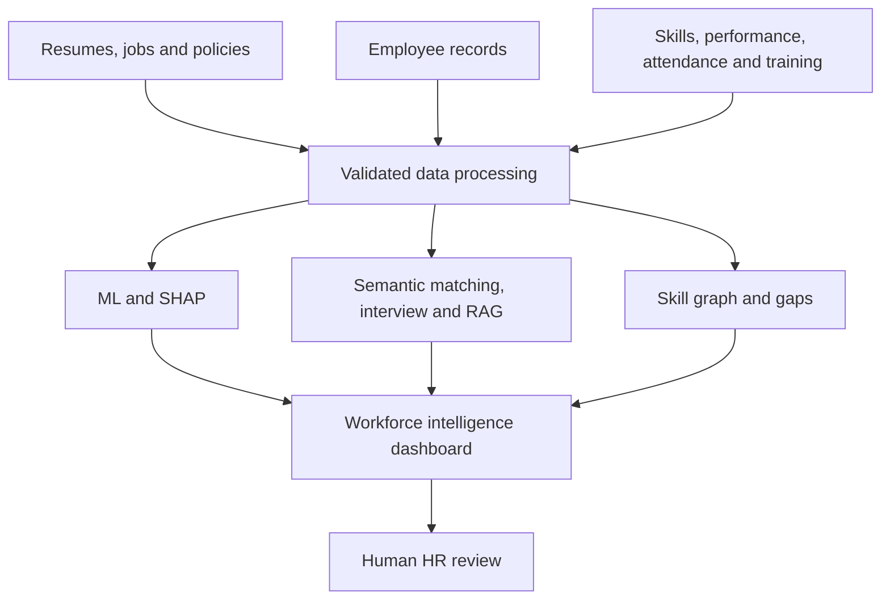

# WorkforceAI — Intelligent HR Decision Support Platform

**Understand people. Detect risks. Discover skills. Support better HR decisions.**

Repository: https://github.com/alisalmann7386-crypto/HR_Platform

A runnable B.Tech Computer Science / Data Science project with Streamlit, attrition ML, sentence-transformer matching, optional LLM assistance, policy RAG, SHAP and NetworkX workforce analytics.

## Abstract and problem statement
HR evidence is fragmented across resumes, job descriptions, employee records, policies and skill inventories. WorkforceAI demonstrates how these sources can be validated, connected through shared records and transformed into inspectable information for authorized human reviewers. It is an academic prototype, not an HR decision automation system.

## Objectives and proposed solution
Compare job-relevant qualifications, generate interview questions, retrieve policy evidence, inspect statistical attrition patterns, map workforce capabilities and show multi-source department summaries. No component hires, rejects, terminates, promotes, changes pay or penalizes a person. The app performs no employment actions.

## Quick start (pretrained artifacts included)
Use Python 3.11 or 3.12. Run commands from the project root.

```bash
python -m venv .venv
# Linux / macOS:
source .venv/bin/activate
# Windows PowerShell instead: .venv\Scripts\Activate.ps1
python -m pip install -r requirements.txt
python scripts/build_policy_index.py --input data/policies
streamlit run app.py
```

Git ignores `vector_store/`. On a fresh deployment, opening the Policy Assistant builds the bundled semantic index automatically and keeps it for subsequent requests. You can also prepare it explicitly with `python scripts/build_policy_index.py --input data/policies`, then run `python scripts/check_deployment.py` to check the saved model and retrieval. MiniLM downloads on first use (internet required) and then uses the Hugging Face cache. No GPU or API key is required for training, matching, retrieval or extractive answers. Optional LLM synthesis requires a key.

On Linux, a CPU-only PyTorch installation can reduce disk use:

```bash
python -m pip install torch --index-url https://download.pytorch.org/whl/cpu
python -m pip install -r requirements.txt
```

If LightGBM reports a missing OpenMP runtime, install your operating system's OpenMP runtime (for example, `libgomp1` on Debian/Ubuntu or `libomp` on macOS).

## Reproduce training and all demo data

```bash
python scripts/run_eda.py --data data/attrition/WA_Fn-UseC_-HR-Employee-Attrition.csv
python scripts/train_attrition.py --data data/attrition/WA_Fn-UseC_-HR-Employee-Attrition.csv
python scripts/generate_demo_data.py
python scripts/create_demo_resumes.py
python scripts/build_policy_index.py --input data/policies
python -m pytest -q
streamlit run app.py
```

Training also invokes EDA. You do not have to rerun training every time you start the app. The saved pipeline and reports are loaded automatically. `notebooks/attrition_eda.ipynb` and `notebooks/model_experiments.ipynb` offer a notebook interface to the same code; notebooks are optional. Use the virtual environment as your Jupyter kernel. Notebook training is disabled by default to avoid accidentally replacing the saved run.

## Modules and integration

| Module | Inputs | Outputs / integration |
|---|---|---|
| Recruitment | PDF/DOCX resumes; pasted or uploaded JD | Structured professional evidence, configurable relevance score, requirement-to-resume matches; candidate records pass to Interview |
| Interview | Same candidate, job and recruitment analysis | Six question categories, answer rubric, JSON/Markdown report with notes |
| Policy RAG | Six supplied PDFs or session uploads | Page/section chunks, MiniLM/FAISS retrieval, source excerpts or optional LLM answer with validated quotes |
| Attrition | Manual form, employee CSV or bundled employee | Uncalibrated model probability, attention band, SHAP log-odds contributions |
| Skills | Employee skills, proficiency, role requirements, demo projects | Typed NetworkX graph, level-aware distinct-employee capacities, gaps and development options |
| Dashboard | IBM profile + predictions + skills + performance + attendance + training | Employee_ID joins, KPIs, department summaries, charts and a policy investigation link |
| Model Performance | Persisted actual experiment outputs | Validation comparison, five-fold CV mean/std, threshold sweep, final test metrics and SHAP |

Recruitment and interview share session state (not a global candidate file). Dashboard auxiliary tables join one-to-one by `Employee_ID`; skill edges are one-to-many. Batch predictions are exportable and remain session-local; they do not overwrite the demonstration organization. Unknown IDs in auxiliary tables are rejected. Graph display filters do not change capacity calculations. HR policy uploads create session-specific temporary indexes rather than replacing the bundled policies.

## Architecture



## Dataset locations and provenance

- `data/attrition/WA_Fn-UseC_-HR-Employee-Attrition.csv`: exact CSV from the user's IBM ZIP; 1,470 rows, 35 original columns. IBM HR data is synthetic; no real-organization generalization claim is made.
- `data/policies/`: six exact user-provided fictional PDFs, 2 pages each. Original `Travel_Reimbursement_Policy.pdf` name is preserved so citations match the source.
- Policies are version 1.0, with a **demo effective date of 1 October 2026**. This date does not make them real or applicable policy.
- `data/workforce/employee_skills.csv`, `performance.csv`, `attendance.csv`, `training.csv`, `role_skill_requirements.csv`, `projects.csv`: reproducible **synthetic auxiliary data**, seed 42. `provenance.json` records their scope. These fields do not train the attrition model.
- `data/resumes/`: two fictional candidates in PDF, DOCX and TXT for demonstration.
- `data/jobs/ml_engineer.txt`: fictional ML Engineer JD.
- `data/processed/employee_upload_example.csv`: batch inference example with required features.
- `data/processed/attrition_predictions.csv`: model estimates and top signals for historical synthetic records, labeled by split. These all-record predictions are **not held-out performance results**.

The project preserves user-provided data for the requested demonstration. Before public redistribution, verify rights and the source dataset's license; the supplied ZIP did not include a license document. Do not replace demo records with confidential data on a public deployment.

## Attrition methodology

1. Validate required columns, unique integer employee IDs and `Yes/No` target. Map target Yes=1 and No=0; derive `EMP-<EmployeeNumber>`.
2. Exclude the target, employee identifiers, constant columns (`EmployeeCount`, `Over18`, `StandardHours`) and `Age`, `Gender`, `MaritalStatus` from model inputs. Exclusion does not by itself guarantee fairness; proxies may remain.
3. Stratified seed-42 split: **1,029 training / 220 validation / 221 test**. Save exact IDs in `reports/split_manifest.json`.
4. ColumnTransformer: numeric median imputation + standardization; categorical mode imputation + one-hot encoding with unknown handling. Fit only on training data. UI validation rejects unfamiliar categorical values for correction, while the encoder itself handles them safely.
5. Compare Logistic Regression, LightGBM, class-weighted LightGBM and SMOTE+LightGBM. SMOTE is inside the imbalanced-learn pipeline and is refit only on each training fold. Standard SMOTE after one-hot encoding can create fractional categories; it is an academic experiment, not a claim that such records are physically valid. Consider SMOTENC in future work.
6. Five-fold stratified CV on training records only; report ROC-AUC, average precision, F1, precision and recall mean/std at 0.50.
7. Predeclared selection: maximum **validation average precision**, tie by ROC-AUC. Threshold selection: maximum validation F1, tie by precision then higher threshold; grid 0.05–0.95 in 0.025 increments.
8. Keep the selected training-fitted pipeline unchanged, evaluate once on test, and save metrics. Do not refit after choosing the threshold without revalidating it.
9. SHAP uses TreeExplainer for LightGBM and LinearExplainer for Logistic Regression. Contributions are **log-odds**, not percentage-point changes and not causes. Selected-model global SHAP uses held-out rows descriptively after selection; weighted-LightGBM SHAP uses training rows for comparison.

LightGBM is a practical tabular boosting experiment because it models nonlinear relationships and interactions. It was not assumed superior. On this split the simpler Logistic Regression baseline performed best under the predeclared selection rule. No extra tuning was performed after inspecting test results.

## Actual results

Validation at threshold 0.50:

| Model | Precision | Recall | F1 | ROC-AUC | Average precision |
|---|---:|---:|---:|---:|---:|
| Logistic Regression | 0.7857 | 0.3143 | 0.4490 | 0.7881 | 0.6099 |
| LightGBM | 0.5556 | 0.1429 | 0.2273 | 0.7384 | 0.3749 |
| Weighted LightGBM | 0.4324 | 0.4571 | 0.4444 | 0.7392 | 0.3426 |
| SMOTE + LightGBM | 0.5625 | 0.2571 | 0.3529 | 0.7408 | 0.4233 |

**Selected model: Logistic Regression. Threshold: 0.35.**

| Final held-out test metric | Value |
|---|---:|
| Accuracy | 0.8552 |
| Precision | 0.5526 |
| Recall | 0.5833 |
| F1 | 0.5676 |
| ROC-AUC | 0.8288 |
| PR-AUC reported as average precision | 0.6413 |
| Brier score | 0.0939 |

Test confusion matrix: TN=168, FP=17, FN=15, TP=21. There are 36 positive test examples; estimates from such a small synthetic test set have substantial uncertainty. The probability is uncalibrated and has no specified forecast horizon. Attention bands: Low < threshold/2; Moderate from threshold/2 to threshold; Elevated ≥ threshold. These bands are visualization choices.

Accuracy can conceal poor minority-class detection. Precision measures how often flagged examples are labeled positive; recall measures how many positives are detected. F1 combines them. Average precision summarizes precision-recall behavior across thresholds; ROC-AUC measures ranking discrimination. All metrics are calculated by code, with exact values in CSV/JSON reports, not hardcoded in the UI.

## Recruitment methodology

The local parser identifies professional sections and a curated vocabulary of technical skills, tools and aliases. It excludes headers/contact details and explicit sensitive lines from scoring. Experience is extracted only when explicitly stated as years of experience; missing values stay unknown. This is not a full CV understanding model: employment date arithmetic, unusual formatting and all negation forms are not solved. Review extraction before use.

Canonical aliases (NLP/Natural Language Processing, Postgres/PostgreSQL, etc.) are strong matches. Otherwise normalized MiniLM embeddings are compared with cosine similarity. A related skill with similarity ≥0.55 receives **partial** credit, never automatic equivalence. The threshold is a transparent heuristic, not a validated competence cutoff. Project and education similarities show the actual requirement and candidate excerpt.

Default weights: mandatory skills 40, preferred 15, experience 20, projects 15, education/certifications 10. Recruiters can change them. Only active components enter the denominator; missing evidence is surfaced. The score is not a hiring probability and candidate tables preserve input order rather than labeling winners or rejected candidates.

## Interview methodology

Local questions use role skills, projects and unmatched requirements. Each question displays its resume or JD basis, and an interviewer can edit or remove it before asking; the report saves the final question and source context. A transparent rubric finds concept words and explicitly leaves technical correctness to the interviewer; it does not pretend that word occurrence proves understanding. Optional LLM mode returns JSON technical analysis with source quotations validated against the answer. Reports contain candidate ID, role, question, answer, observed concepts, missing concepts, follow-up and interviewer notes. No personality, emotion, honesty, intelligence or employability inference is requested.

## RAG methodology and configuration

PDF extraction → page-preserving section detection → whitespace cleanup → overlapping chunks → normalized MiniLM embeddings → FAISS inner-product search (cosine on normalized vectors) → retrieved evidence → optional LLM synthesis.

Default model: `sentence-transformers/all-MiniLM-L6-v2` (384 dimensions). Defaults: **140 words per chunk, 25-word overlap, top_k=6, minimum similarity=0.30**. The supplied pack creates 72 chunks across 12 pages. Chunk metadata contains filename, page number, section, stable chunk ID and document SHA-256. Chunk sizes use words, not tokens; the default is kept modest for MiniLM's input limit.

Without an API key, the app returns exact retrieved excerpts with citations and clearly labels them extractive. With a configured LLM, it asks for structured claims and validates that each source ID exists and each quote is a verbatim substring of that source. This prevents invented citation IDs/quotes, but does not prove the generated interpretation is entailed. Low-score retrieval or invalid generated citations triggers an abstention. Similarity is **not calibrated confidence**. Policies about absent topics should be referred to HR; do not infer entitlements from nearby content.

Unavailable embeddings do not silently change the algorithm. An explicit fallback is provided:

```bash
python scripts/build_policy_index.py --input data/policies --backend lexical
```

This uses TF-IDF with FAISS, visibly labeled lexical rather than semantic. Select lexical matching separately on the recruitment page. A semantic index must be queried with the same embedding model; its model name is persisted. Rebuild indexes after changing source policies or embedding model.

## Environment variables / optional LLM

Copy `.env.example` to `.env` locally. Never commit `.env` or API keys.

| Variable | Purpose |
|---|---|
| `LLM_PROVIDER` | `none` (default), `groq`, `mistral`, `openai`, or `compatible` |
| `LLM_API_KEY` | Provider credential |
| `LLM_MODEL` | Exact model identifier available in your provider account |
| `LLM_BASE_URL` | HTTPS API base ending in `/v1` for compatible providers |
| `EMBEDDING_MODEL` | Hugging Face model ID or local SentenceTransformer directory |
| `EMBEDDING_BACKEND` | Index CLI default: `semantic` or explicit `lexical` |
| `RAG_TOP_K` | Default retrieved chunk count |
| `RAG_CHUNK_SIZE` / `RAG_CHUNK_OVERLAP` | Chunk word counts |
| `RAG_MIN_SIMILARITY` | Heuristic retrieval threshold |

LLM requests use an OpenAI-compatible chat endpoint through `requests`; LangChain is intentionally unnecessary here. Enable the per-module checkbox to send submitted content to your configured provider. Do not send real confidential data without authorization. No provider key was supplied for this build, so live external LLM calls remain unverified. Mocked schema/citation failure behavior is tested.

## Skill graph and gap methodology

NetworkX nodes use typed identifiers to avoid name collisions: Employee, Skill, Role, Department, Project. Relations include HAS_SKILL, WORKS_AS, BELONGS_TO, REQUIRES, ASSIGNED_TO and USES. Plotly renders an interactive spring layout with deterministic seed 42.

For each role–skill requirement, count distinct employees in that role with proficiency at or above the required level. Gap = max(required employees − available employees, 0). Duplicate skill records do not inflate counts. An employee may cover several skills, so capacities cannot simply be summed into a headcount or interpreted as a resource allocation plan. Targets, projects and auxiliary skills are synthetic. Suggestions describe training, mentoring, rotations or recruitment options for human review.

## Project structure and generated artifacts

Exported EDA HTML charts load Plotly from its CDN (internet required); Streamlit charts use the installed package.

See `reports/DIRECTORY_TREE.txt` for the final file inventory. Main source directories are `src/recruitment`, `src/interview`, `src/rag`, `src/attrition`, `src/skills`, `src/dashboard` and `src/utils`; each contains focused modules. `app.py` configures navigation, with individual pages under `pages/`.

- `models/`: selected pipeline, metadata, all four experiment pipelines, training SHAP background, comparison and threshold tables.
- `reports/`: comparison, training CV, final test predictions/metrics, global SHAP, experiment records, exact split manifest, EDA, verification, demo guide and report outline.
- `vector_store/`: generated index, metadata and chunks; ignored by Git.
- `notebooks/`: EDA and controlled experiment notebooks.
- `tests/`: parser, matching, ML isolation, reload, SHAP, retrieval/citation, graph, integration and Streamlit page tests.
- `requirements-lock.txt`: exact installed build environment (Python 3.12/Linux). `requirements.txt` is the portable bounded dependency list. CPU PyTorch wheels may require the PyTorch index when using the lockfile.

## UI and six improvement checks

The interface uses one shared dark navy/blue design system across the sidebar, controls, cards, tables and charts. The landing page shows six modules and the source-to-dashboard workflow. Recruitment has a step-based flow and requirement evidence; interview questions can be edited; policy results show source cards and exact retrieved text; individual and batch attrition views display separate SHAP directions; the skills page offers an employee detail view. The persisted metrics remain sourced from real model outputs.

Evaluation cases in `data/evaluation/` are **author-curated fictional examples**, not independent labels or evidence of real HR effectiveness. Run:

```bash
python scripts/evaluate_recruitment.py --backend semantic
python scripts/evaluate_policy.py --top-k 5
python scripts/evaluate_calibration.py
python scripts/check_deployment.py
```

For the 39 curated recruitment cases: skill extraction precision **0.986**, recall **0.971**; semantic requirement alignment precision **0.957**, recall **1.000**. The cases include negation and related-but-distinct tools, yet remain a small synthetic benchmark. Review per-case evidence in `reports/recruitment_cases_semantic.csv` and expand the set with independently reviewed real-world-style resumes before making broader claims.

For 26 fictional policy questions (22 with expected sources and 4 out of scope), source Recall@5 is **1.000**; unsupported-question abstention is **0.750**. The cryptocurrency reimbursement query retrieves related expense text despite lacking an answer. Retrieved evidence is not proof that a query is answered; human checking is required. See `reports/policy_retrieval_cases.csv`.

`reports/reliability_bins.csv` and `reports/calibration_uncertainty.json` describe the held-out synthetic data: five-bin reliability and 1,000 deterministic percentile bootstrap resamples, including F1 interval approximately **0.424–0.689**. This does not calibrate the model or supply an external confidence guarantee. No test labels were used to select a model or threshold. `Model Performance` plots these files. The `Python checks` GitHub Actions workflow installs dependencies, builds the index and runs tests/evaluations for each PR.

## Screenshots and demonstration

See `reports/DEMO_GUIDE.md` for a 7–10 minute walkthrough. Browser screenshots could not be captured in the build sandbox because Chromium socket creation was blocked. Streamlit AppTest verified all pages and interactions; browser visual review remains unverified. Capture screenshots locally for your final report. No synthetic screenshots are presented as application captures.

## Verification

Run `python -m pytest -q`. Semantic tests need the model and index. For a restricted offline environment, `python -m pytest -q -m 'not semantic'` tests local core functionality. The 30 September repository review passed **57 tests**; the 3 October UI and evaluation update passed **62 tests**, including 17 added regression cases for document uploads, session isolation, malformed policy responses and workforce identity validation. Exact build outcomes and remaining unverified items are in `reports/VERIFICATION.md`. Do not claim LLM quality from retrieval tests or a mocked response.

## Deployment

For Streamlit Community Cloud or another host, use `app.py` as the entry point, Python 3.12, and install `requirements.txt`. Trusted model files are committed already; no retraining is required for a normal demo. The first visit to the Policy page builds the bundled index when needed. To check a fresh checkout before deployment, run `python scripts/check_deployment.py`. Add environment variables using the host's secret settings. Do not publish this prototype with real HR data: it lacks authentication, role-based access control, encryption policy, audit trails and multi-tenant storage controls.

## Ethical considerations and limitations

IBM data is small and synthetic; auxiliary data and policies are fictional. No temporal forecast horizon or enterprise validation is available. Performance cannot be generalized to real employers. SHAP describes model behavior, not causes; correlation is not evidence for a personnel action. Sensitive field exclusion does not eliminate proxies or bias. Resume parsing is bounded and heuristic; semantic similarity does not verify competence. LLM output depends on context and may misinterpret it. Policies differ by employer and jurisdiction. Session state is not a production records system; uploaded temporary files remain on disk until host cleanup. Source quotation checks and prompt instructions are not a complete prompt-injection defense. Human review is necessary throughout.

## Future scope

Authorized HRMS integration; longitudinal/temporal models; calibration and external validation; bias evaluation; role-based access, audit and retention controls; curated skill ontology; SMOTENC; hybrid retrieval; RAG evaluation benchmarks; Neo4j; model monitoring and drift detection; CI/CD and MLOps.

## Contributors

Project owner: Md Salman Ali. Add verified teammate names and institutional supervisor details before submission. Do not present AI-generated implementation as independently authored where institutional disclosure is required.

## Technical references

These are official implementation references, not fabricated research-paper citations:

- [SentenceTransformer API](https://www.sbert.net/docs/package_reference/sentence_transformer/model.html)
- [SHAP TreeExplainer](https://shap.readthedocs.io/en/stable/generated/shap.TreeExplainer.html)
- [imbalanced-learn sampling pipelines](https://imbalanced-learn.org/stable/auto_examples/pipeline/plot_pipeline_classification.html)

Literature-review placeholders requiring verified academic references are in the report outline.
